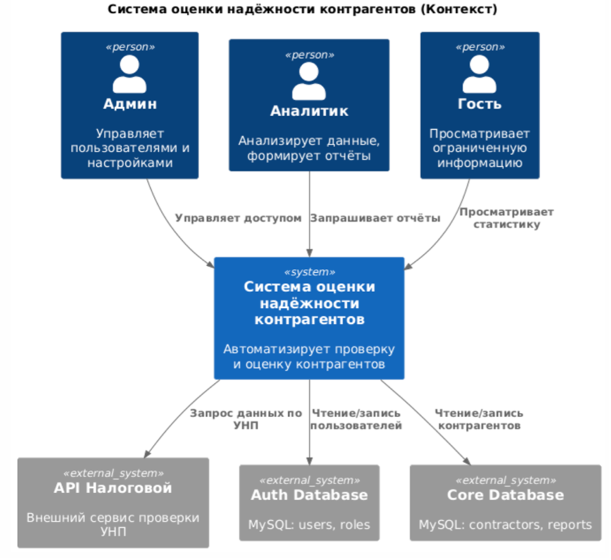
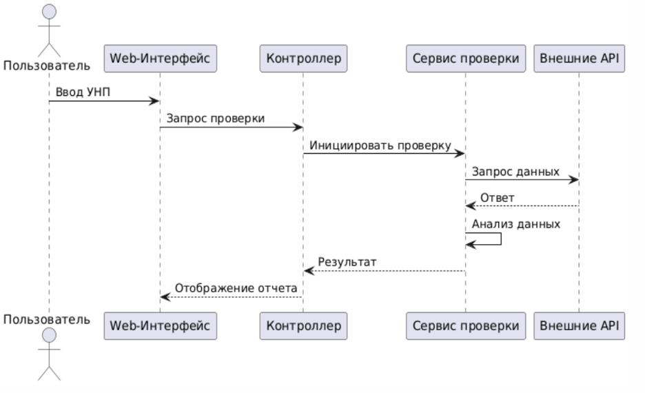

# **Система управления контрагентами**

Система управления контрагентами - это веб-приложение, разработанное для эффективного управления и мониторинга взаимодействий с контрагентами. Система позволяет создавать, редактировать и отслеживать информацию о контрагентах, управлять договорами и документами, а также анализировать историю взаимодействий.

## **Структура репозиториев**

Проект разделен на три отдельных репозитория:

1. [contragent-work-client](https://github.com/your-username/contragent-work-client) - Клиентская часть приложения
2. [contragent-work-server](https://github.com/your-username/contragent-work-server) - Серверная часть приложения
3. [contragent-work-docs](https://github.com/your-username/contragent-work-docs) - Документация проекта (текущий репозиторий)

**Репозитории проекта:**
- Сервер: [ссылка на серверный репозиторий]
- Клиент: [ссылка на клиентский репозиторий]

---

## **Содержание**

1. [Архитектура](#архитектура)
    1. [C4-модель](#c4-модель)
    2. [Схема данных](#схема-данных)
2. [Функциональные возможности](#функциональные-возможности)
    1. [Диаграмма вариантов использования](#диаграмма-вариантов-использования)
    2. [User-flow диаграммы](#user-flow-диаграммы)
3. [Детали реализации](#детали-реализации)
    1. [UML-диаграммы](#uml-диаграммы)
    2. [Спецификация API](#спецификация-api)
    3. [Безопасность](#безопасность)
    4. [Оценка качества кода](#оценка-качества-кода)
4. [Тестирование](#тестирование)
    1. [Unit-тесты](#unit-тесты)
    2. [Интеграционные тесты](#интеграционные-тесты)
5. [Установка и запуск](#установка-и-запуск)
    1. [Манифесты для сборки docker образов](#манифесты-для-сборки-docker-образов)
    2. [Манифесты для развертывания k8s кластера](#манифесты-для-развертывания-k8s-кластера)
6. [Лицензия](#лицензия)
7. [Контакты](#контакты)

---

## **Архитектура**

### C4-модель

### Схема данных

---

## **Функциональные возможности**

### Диаграмма вариантов использования

### User-flow диаграммы

---

## **Детали реализации**

### UML-диаграммы

### Спецификация API

openapi: 3.0.0
info:
  title: API Документация
  description: Разработанная документация предоставляет разработчикам полное описание всех рабочих методов API, включая функционал для проверки контрагентов, формирования отчетов и администрирования пользователей.
  version: 1.0.0
servers:
  - url: https://api.example.com/v1
    description: Production Server

# Определения схем
components:
  schemas:
    ContragentRequest:
      type: object
      properties:
        unp:
          type: string
          description: 9-значный УНП
          example: "100123456"
    ContragentResponse:
      type: object
      properties:
        status:
          type: string
          example: "success"
        data:
          type: object
          properties:
            company_info:
              type: object
              description: Информация о компании
            reliability_rating:
              type: number
              description: Рейтинг надежности контрагента
    Error:
      type: object
      properties:
        status:
          type: string
          example: "error"
        message:
          type: string
          example: "Неверный формат УНП"

# Путь для проверки контрагента
paths:
  /check:
    post:
      summary: Проверка контрагента
      description: Проверяет надежность контрагента по УНП через интеграцию с МНС и JustBel.
      requestBody:
        required: true
        content:
          application/json:
            schema:
              $ref: '#/components/schemas/ContragentRequest'
      responses:
        '200':
          description: Успешный ответ
          content:
            application/json:
              schema:
                $ref: '#/components/schemas/ContragentResponse'
        '400':
          description: Неверный формат УНП
          content:
            application/json:
              schema:
                $ref: '#/components/schemas/Error'
        '500':
          description: Ошибка сервера
          content:
            application/json:
              schema:
                $ref: '#/components/schemas/Error'

# Другие пути (пример)
  /report:
    get:
      summary: Получение отчета
      description: Формирует отчет на основе исторических данных.
      parameters:
        - name: start_date
          in: query
          description: Дата начала периода
          required: true
          schema:
            type: string
            format: date
        - name: end_date
          in: query
          description: Дата окончания периода
          required: true
          schema:
            type: string
            format: date
      responses:
        '200':
          description: Успешный ответ
          content:
            application/json:
              schema:
                type: object
                properties:
                  report_data:
                    type: array
                    items:
                      type: object
                      properties:
                        date:
                          type: string
                          format: date
                        value:
                          type: number
        '400':
          description: Неверные параметры запроса
          content:
            application/json:
              schema:
                $ref: '#/components/schemas/Error'
        '500':
          description: Ошибка сервера
          content:
            application/json:
              schema:
                $ref: '#/components/schemas/Error'

# Авторизация
securitySchemes:
  BearerAuth:
    type: http
    scheme: bearer
    bearerFormat: JWT

# Безопасность
security:
  - BearerAuth: []

## **Тестирование**

### Unit-тесты

Unit-тесты
require_once 'path/to/tests/bootstrap.php';
require_once 'path/to/src/utils/JwtUtil.php';

class JwtUtilTest extends PHPUnit\Framework\TestCase {
    private $testUser;

    protected function setUp(): void {
        $this->testUser = [
            'id' => 1,
            'username' => 'testuser',
            'email' => 'test@example.com',
            'role_name' => 'user'
        ];
    }

    public function testGenerateToken() {
        $token = JwtUtil::generateToken($this->testUser);
        $this->assertMatchesRegularExpression('/^[a-zA-Z0-9\-_]+\.[a-zA-Z0-9\-_]+\.[a-zA-Z0-9\-_]+$/', $token);
    }

    public function testValidateValidToken() {
        $token = JwtUtil::generateToken($this->testUser);
        $userData = JwtUtil::validateToken($token);
        $this->assertEquals($this->testUser['id'], $userData['id']);
        $this->assertEquals($this->testUser['username'], $userData['username']);
        $this->assertEquals($this->testUser['email'], $userData['email']);
        $this->assertEquals($this->testUser['role_name'], $userData['role']);
    }

    public function testValidateExpiredToken() {
        $reflector = new ReflectionClass('JwtUtil');
        $encodeMethod = $reflector->getMethod('encode');
        $encodeMethod->setAccessible(true);

        $payload = [
            'iat' => time() - 3600,
            'exp' => time() - 1800, // Токен истек 30 минут назад
            'data' => [
                'id' => $this->testUser['id'],
                'username' => $this->testUser['username'],
                'email' => $this->testUser['email'],
                'role' => $this->testUser['role_name']
            ]
        ];

        $token = $encodeMethod->invokeArgs(null, [$payload]);
        $this->assertFalse(JwtUtil::validateToken($token));
    }

    public function testValidateInvalidToken() {
        $this->assertFalse(JwtUtil::validateToken('invalid.token.string'));
    }
}

require_once 'path/to/tests/bootstrap.php';
require_once 'path/to/src/controllers/AuthController.php';

class AuthControllerTest extends PHPUnit\Framework\TestCase {
    private $authController;
    private $mockUserModel;

    protected function setUp(): void {
        $this->mockUserModel = $this->createMock(User::class);
        $this->authController = new class($this->mockUserModel) extends AuthController {
            private $userModel;
            public function __construct($userModel) {
                $this->userModel = $userModel;
            }
            protected function getUserModel() {
                return $this->userModel;
            }
        };
    }

    public function testLoginInvalidCredentials() {
        $_SERVER['REQUEST_METHOD'] = 'POST';
        $_POST['username'] = 'testuser';
        $_POST['password'] = 'wrongpassword';

        $this->mockUserModel->expects($this->once())
            ->method('validateCredentials')
            ->with('testuser', 'wrongpassword')
            ->willReturn(false);

        $this->expectOutputRegex('/"status":"error"/');
        $this->authController->login();
    }

    public function testValidateTokenSuccess() {
        $_SERVER['HTTP_AUTHORIZATION'] = 'Bearer valid.token.here';

        JwtUtil::staticExpects($this->once())
            ->method('validateToken')
            ->with('valid.token.here')
            ->willReturn([
                'id' => 1,
                'username' => 'testuser',
                'email' => 'test@example.com',
                'role' => 'user'
            ]);

        ob_start();
        $this->authController->validateToken();
        $output = ob_get_clean();

        $response = json_decode($output, true);
        $this->assertEquals('success', $response['status']);
        $this->assertArrayHasKey('user', $response['data']);
    }
}

### Интеграционные тесты

Интеграционные тесты

require_once 'path/to/tests/bootstrap.php';

class ApiAuthTest extends PHPUnit\Framework\TestCase {
    private $baseUrl = 'http://localhost/contragent_work/services/auth/api';

    public function testLoginEndpoint() {
        $userData = [
            'username' => 'testuser',
            'password' => 'password123'
        ];

        $response = $this->performHttpRequest($this->baseUrl . '/login.php', 'POST', $userData);
        $this->assertEquals(200, $response['status']);
        $data = json_decode($response['body'], true);
        $this->assertEquals('success', $data['status']);
        $this->assertArrayHasKey('token', $data['data']);
    }

    public function testValidateTokenEndpoint() {
        $userData = [
            'username' => 'testuser',
            'password' => 'password123'
        ];
        $loginResponse = $this->performHttpRequest($this->baseUrl . '/login.php', 'POST', $userData);
        $loginData = json_decode($loginResponse['body'], true);
        $token = $loginData['data']['token'];

        $response = $this->performHttpRequest(
            $this->baseUrl . '/validate-token.php',
            'GET',
            null,
            ['Authorization' => 'Bearer ' . $token]
        );

        $this->assertEquals(200, $response['status']);
        $data = json_decode($response['body'], true);
        $this->assertEquals('success', $data['status']);
        $this->assertArrayHasKey('user', $data['data']);
    }

    private function performHttpRequest($url, $method, $data = null, $headers = []) {
        $ch = curl_init();
        curl_setopt($ch, CURLOPT_URL, $url);
        curl_setopt($ch, CURLOPT_RETURNTRANSFER, true);

        if ($method === 'POST') {
            curl_setopt($ch, CURLOPT_POST, true);
            if ($data) {
                curl_setopt($ch, CURLOPT_POSTFIELDS, json_encode($data));
                $headers['Content-Type'] = 'application/json';
            }
        }

        if (!empty($headers)) {
            $curlHeaders = [];
            foreach ($headers as $key => $value) {
                $curlHeaders[] = "$key: $value";
            }
            curl_setopt($ch, CURLOPT_HTTPHEADER, $curlHeaders);
        }

        $body = curl_exec($ch);
        $status = curl_getinfo($ch, CURLINFO_HTTP_CODE);
        curl_close($ch);

        return [
            'status' => $status,
            'body' => $body
        ];
    }
}

require_once 'path/to/tests/bootstrap.php';

class ApiSecurityTest extends PHPUnit\Framework\TestCase {
    private $baseUrl = 'http://localhost/contragent_work/api';

    public function testProtectedEndpointWithoutToken() {
        $response = $this->performHttpRequest($this->baseUrl . '/users/index.php', 'GET');
        $this->assertEquals(401, $response['status']);
        $data = json_decode($response['body'], true);
        $this->assertEquals('error', $data['status']);
        $this->assertStringContainsString('Token', $data['message']);
    }

    public function testXssProtection() {
        $xssPayload = '';
        $userData = [
            'username' => $xssPayload,
            'password' => 'password123'
        ];

        $response = $this->performHttpRequest(
            $this->baseUrl . '/auth/login.php',
            'POST',
            $userData
        );

        $this->assertNotEquals(200, $response['status']);
        $this->assertStringNotContainsString($xssPayload, $response['body']);
    }
}

---

## **Лицензия**

Этот проект лицензирован по лицензии MIT - подробности представлены в файле [LICENSE.md](LICENSE.md)

---

## **Контакты**

Автор: golovachnastya9@gmail.com 